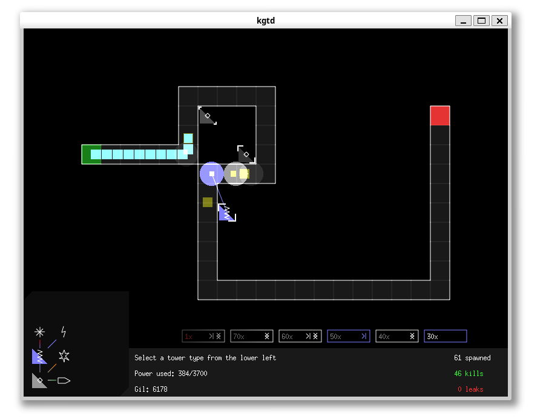

# KGTD

KGTD is a tower-defense game that uses SDL and OpenGL, with an emphasis on code
quality and efficiency.

This game was originally developed by [Chris Lu](https://lulabs.net/) in 2013. This repository is a fork with some minor changes to the code.



## The Game

Defensive towers are fed with variable amounts of power from a central source. The
total amount of power is fixed, and towers fire at a rate or do damage
proportional to the power fed. For strategic purposes, the distribution of
power can be changed on the fly. Towers have a variety of damage types, which
do differing amounts of damage to shields and armor.

The game has currently only 2 levels, feel free to add more!

## Build

On Ubuntu, you can install the dependencies with the following command:

```bash
sudo apt-get install libsdl1.2-dev libsdl-image1.2-dev libsdl-ttf2.0-dev libgl1-mesa-dev
make
```
